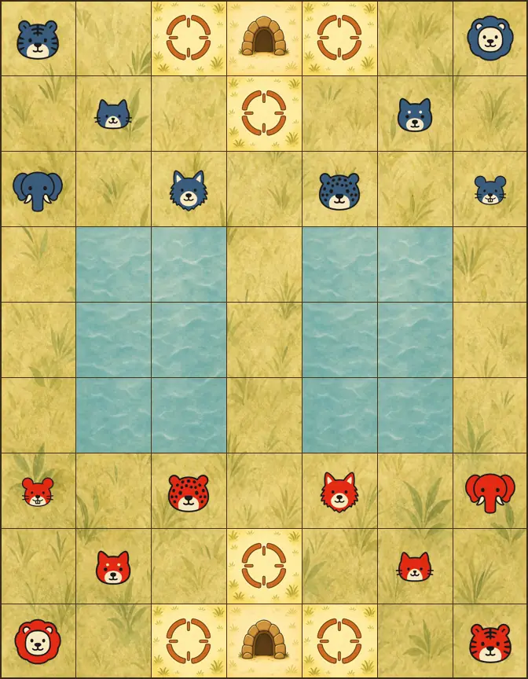

# MistyJungle

[](https://github.com/brianhliou/misty-jungle/actions/workflows/ci.yml)
[](https://github.com/brianhliou/misty-jungle/releases/latest)
[](LICENSE)

A classical [Dou Shou Qi](https://en.wikipedia.org/wiki/Jungle_(board_game)) (Jungle, or Animal
Chess) engine in Rust: alpha-beta search with a transposition table, iterative deepening,
quiescence, and a handcrafted evaluation. No neural network. It ships as a small UCI binary,
with the same search core exposed to Python via PyO3.

<p align="center">
  <a href="https://mistboard.com/?play=computer&gameSpecId=jungle">
    
  </a>
  <br>
  <sub><i>Misty Jungle (level 3, red) vs level 2 — a full game, won by marching into the den.</i></sub>
</p>

**Play it in your browser:** challenge MistyJungle on
[mistboard.com](https://mistboard.com/?play=computer&gameSpecId=jungle). No install required.

## The game

Dou Shou Qi is a 7×9 race-and-capture game. Eight animals rank from rat to elephant, and a higher animal
captures a lower one, with one twist: the rat captures the elephant. Rivers split the board and
only the rat may swim them; lions and tigers leap across. You win by reaching the enemy den or
capturing every piece.

## Strength

Against the strongest open-source Dou Shou Qi engine I could find and run, MistyJungle scored
W11-L2-D187 over 200 games, about +16 Elo in a drawish game. Its four-piece endgame play matches
exact retrograde tablebases with no win, draw, or loss errors.

Full build report:
[Building a Dou Shou Qi Engine](https://brianhliou.com/posts/building-dou-shou-qi-engine/).

## Build

A prebuilt UCI binary ships with each [release](https://github.com/brianhliou/misty-jungle/releases/latest).
To build from source you need only a Rust toolchain:

```bash
cargo build -p jungle-engine --release
./target/release/jungle-engine
```

It speaks a minimal UCI-style protocol: `position`, then `go [movetime <ms>] [nodes <n>]`,
replying `bestmove <uci>`. Strength is a node budget, so results are reproducible across machines.

The Python bindings (`jungle_rust`) build with [maturin](https://github.com/PyO3/maturin):

```bash
maturin develop --release
```

The browser build is single-threaded WebAssembly:

```bash
wasm-pack build jungle-wasm --target web --release
```

It exposes one-shot `analyze` plus a stateful `AnalysisSession`. Repeated bounded
`step(nodes)` calls preserve iterative-deepening state, the transposition table, Zobrist
state, and move-ordering history while giving the browser a cancellation boundary between
slices.

## Layout

- `jungle_rust/`: the engine core (`src/engine.rs`) and the PyO3 bindings (`src/lib.rs`).
- `jungle-engine/`: the UCI binary, which `#[path]`-includes the engine core.
- `jungle-wasm/`: the wasm-bindgen browser API, including incremental analysis sessions.

## License

MIT, see [LICENSE](LICENSE).
